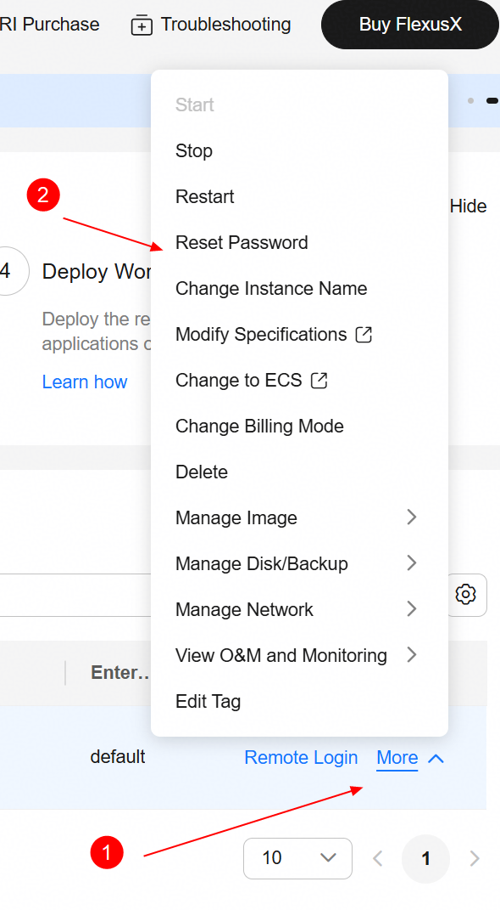
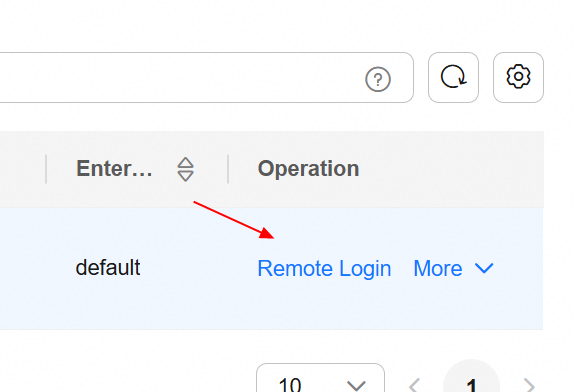
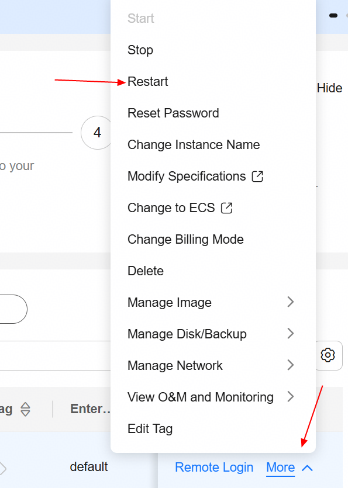
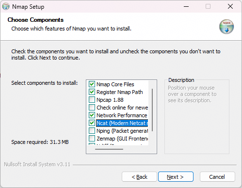
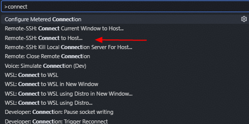

<figure>

</figure>

Huawei Technologies CO., LTD

**v6.16.0** — September 25, 2026 23:41

# Provision a Flexus X Instance on Huawei Cloud

<div class="informalexample">

**General Objective:** Provision a Flexus X instance on Huawei Cloud
that will host a complete coding stack environment: the
[oh-my-coding-maas-gateway](https://github.com/wallacelw/oh-my-coding-maas-gateway)
(a LiteLLM-based proxy with load balancing, virtual keys, and Grafana
observability), governance tooling, and multiple coding agents --- with
OpenCode as the primary one. By the end of this chapter you will have a
running Flexus X instance with a public IP accessible over SSH.

**Prerequisites:**

- Active Huawei Cloud account with IAM credentials.

- Permission to create security groups, Flexus X instances, and EIPs.

- A key pair created in the Console, or permission to create one.

- A web browser (Chrome, Firefox, or Edge).

</div>

<div class="note">

This guide assumes the `sa-brazil-1` region. Adjust the region if your
account is registered elsewhere.

</div>

## Create the security group (sg-xgate)

**Objective:** Create a security group that allows SSH access on port
4444 from specific Huawei internal IPs only.

<div class="note">

We use port `4444` instead of the standard SSH port `22` because the
Huawei corporate proxy blocks outbound connections on port 22. Port
`4444` is allowed through the proxy and works reliably for SSH.

</div>

**Step by step:**

1.  In the Console, go to menu:VPC\[Security Groups\] and click **Create
    Security Group**.

2.  Name it `sg-xgate` and add the following inbound rules:

        Rule 1:
          Protocol:    TCP
          Port:        4444
          Source:      119.8.89.193/32
          Description: SSH for Huawei internal user 1

        Rule 2:
          Protocol:    TCP
          Port:        4444
          Source:      119.8.89.3/32
          Description: SSH for Huawei internal user 2

        Rule 3:
          Protocol:    TCP
          Port:        4444
          Source:      119.8.193.3/32
          Description: SSH for Huawei internal user 3

3.  Click **OK** to create the security group.

<div class="tip">

Each `/32` rule restricts access to exactly one IP address. Only the
three listed Huawei internal IPs can reach the instance on port 4444 ---
no other inbound traffic is allowed.

</div>

## Create the Flexus X instance

**Objective:**- Launch a single Flexus X instance using the Console
wizard, using the security group created above.

**Step by step:**

1.  Log in to the [Huawei Cloud
    Console](https://console.huaweicloud.com/) and select the
    `sa-brazil-1` region in the top-right corner.

2.  Open the service catalog and select **Flexus X** (under
    **Compute**).

3.  Click **Create Flexus X** to open the creation wizard.

4.  Under **Billing Mode**, select **Pay-per-use**.

<div class="tip">

Pay-per-use bills by the hour with no long-term commitment. You only pay
for the time the instance is running. This is ideal for development and
testing --- stop the instance when not in use to reduce costs.

</div>

1.  Set the compute resources using the slider: drag to **4 vCPU** and
    **16 GB RAM**.

<div class="note">

Flexus X uses a slider for vCPU and memory instead of fixed flavor
names. The resulting flavor ID is `x1.4u.16g`, but you select it by
dragging the vCPU and RAM controls --- there is no flavor dropdown.

</div>

1.  Fill in the remaining basic configuration:

        AZ:             Any (choose the availability zone you prefer)
        Image:          Ubuntu 24.04 Server 64bit
        Disk:           100 GB General Purpose SSD
        VPC:            vpc-default
        Subnet:         subnet-default
        Security Group: sg-xgate (port 4444, Huawei internal IPs only)

<div class="warning">

The EIP is auto-assigned and configured to be released when the instance
is deleted. If you need a fixed IP that persists across stop/start
cycles, allocate a dedicated EIP and bind it manually after creation.

</div>

1.  Under **EIP** settings, configure the public IP:

        EIP:            Auto-assign
        Billing:        Pay by traffic
        Bandwidth:      1000 Mbit/s
        Release:        Yes — release EIP when instance is deleted

2.  Under **Cloud Eye**, enable monitoring (recommended).

<div class="note">

Cloud Eye is a monitoring service that provides functions such as
real-time monitoring, alarm reporting, resource grouping, and website
monitoring. Enabling it gives you visibility into instance health, CPU,
memory, and network metrics out of the box.

</div>

1.  Set the instance name to `flexusx-dev` (or any name you prefer).

2.  Under **Login Configuration**, select **Key pair** as the
    authentication method. If you do not yet have a key pair, click
    **Create Key Pair** to generate one inside Huawei Cloud and download
    the `.pem` file.

<div class="note">

The key pair is the primary access method. Later, you can set a root
password on the instance (via the Console or after first login with the
key) to have a second way to access the instance.

</div>

1.  Click **Create Now** and wait for the status to change to
    **Running**.

## Verify the instance

On the instance details page, copy the **EIP** field. This is the
address you will use to connect in the next chapters.

| Step           | What to check                  | Expected result     |
|----------------|--------------------------------|---------------------|
| Security group | `sg-xgate` with TCP 4444 rules | 3 inbound rules     |
| Billing mode   | Pay-per-use selected           | Hourly billing      |
| Compute        | 4 vCPU, 16 GB RAM via slider   | Flavor `x1.4u.16g`  |
| Image          | Ubuntu 24.04 Server 64bit      | Selected            |
| EIP            | Auto-assigned                  | Public IP available |
| Cloud Eye      | Monitoring enabled             | Metrics visible     |
| Instance name  | `flexusx-dev`                  | Set                 |
| Key pair       | Created and downloaded         | `.pem` file saved   |
| Instance       | Status is **Running**          | EIP copied          |

**Table 1:** Chapter 1 verification checklist.

# Configure Flexus X for Remote Access

<div class="informalexample">

**General Objective:** Prepare the Flexus X instance for remote access
by setting a root password via the Console and changing the SSH port
from 22 to 4444. This is required because the Huawei corporate proxy
blocks outbound connections on port 22.

**Prerequisites:**

- Chapter 1 completed — Flexus X instance running with a public IP.

- Access to the Huawei Cloud Console.

</div>

## Set the root password

**Objective:** Use the Console to reset the root password of the Flexus
X instance.

**Step by step:**

1.  In the Console, navigate to **Flexus X** and click on the instance
    `flexusx-dev`.

2.  In the instance details page, click menu:More\[Reset Password\].

    <figure>
    
    <figcaption><strong>Figure 1:</strong> Reset Password option in the
    Flexus X details page.</figcaption>
    </figure>

3.  Enter a strong root password and confirm. Click **OK**.

4.  The instance will restart automatically. Wait for the status to
    return to **Running**.

<div class="warning">

Choose a strong password (12+ characters, mixed case, digits, symbols).
This password enables remote login directly from the Console and serves
as a second access method alongside the SSH key pair.

</div>

## Change the SSH port to 4444

**Objective:** Log in via the Console remote login, edit `sshd\_config`,
and change the SSH port from 22 to 4444.

**Step by step:**

1.  In the instance details page, click **Remote Login**. A
    browser-based terminal opens.

    <figure>
    
    <figcaption><strong>Figure 2:</strong> Remote Login button in the Flexus
    X details page.</figcaption>
    </figure>

2.  Log in as `root` using the password set in the previous subsection.

3.  Open the SSH daemon configuration file:

    ``` bash
    sudo vim /etc/ssh/sshd_config
    ```

4.  Find the line `Port 22` (or `#Port 22`) and change it to:

        Port 4444

5.  Save and exit vim (`:wq`).

6.  Reboot the instance from the Console to apply the change. The SSH
    daemon will start automatically on port 4444 after reboot.

    <figure>
    
    <figcaption><strong>Figure 3:</strong> Restart the Flexus X instance
    from the Console.</figcaption>
    </figure>

    \+ WARNING: The reboot is **mandatory** --- not optional. Until the
    instance is rebooted, SSH continues listening on port 22 and the
    proxy `CONNECT` to port 4444 will fail with
    `Ncat: Error reading proxy response Status-Line`. If you skip this
    step, all subsequent SSH connections through the proxy will fail.

<div class="note">

After this change, SSH connections must use `Port 4444` explicitly. The
security group `sg-xgate` (created in Chapter 1) already allows inbound
TCP 4444 from the authorized Huawei internal IPs.

</div>

## Verify the configuration

Use the table below to confirm all steps were completed successfully
before proceeding to the next chapter:

| Step             | What to check                         | Expected result |
|------------------|---------------------------------------|-----------------|
| Security group   | `sg-xgate` exists with TCP 4444 rules | 3 inbound rules |
| Flexus X running | Instance `flexusx-dev` status         | **Running**     |
| Root password    | Remote Login works with password      | Shell prompt    |
| SSH port         | `sshd\_config` has `Port 4444`        | Config saved    |
| SSH restart      | Instance rebooted from Console        | Service active  |

**Table 2:** Chapter 2 verification checklist.

# Install ncat and SSH Connection Topology

<div class="informalexample">

**General Objective:** Install `ncat` (from Nmap) on your local Windows
machine and understand the SSH connection topology through the Huawei
corporate proxy (xgate). ncat serves as the SSH `ProxyCommand`,
tunneling SSH through the HTTP proxy via the `CONNECT` method.

**Prerequisites:**

- Chapter 2 completed — Flexus X configured with root password and SSH
  on port 4444.

- The private key file (`.pem`) downloaded from Huawei Cloud.

</div>

<div class="note">

**Premises:**

</div>

- The proxy is **xgate** (Huawei corporate proxy) at
  `proxy.huawei.com:8080`.

- SSH runs on port `4444` (configured in Chapter 2).

- Login as `root` using the key pair from Chapter 1.

- `ncat` (from Nmap) is used as the `ProxyCommand` to tunnel SSH through
  the HTTP proxy via the `CONNECT` method.

- Proxy authentication is transparent --- it is handled by the corporate
  VPN, not by credentials in the SSH config.

## How the connection works

When you specify a `ProxyCommand` in the SSH config, SSH launches `ncat`
as a child process. ncat performs the HTTP `CONNECT` handshake with the
proxy:

    ncat -> proxy:   CONNECT <EIP>:4444 HTTP/1.1
                     Host: <EIP>:4444

    proxy -> ncat:   HTTP/1.1 200 Connection Established

    [Both sides now send raw TCP bytes -- SSH negotiation begins over the tunnel]

After the `200 Connection Established` response, the proxy becomes a
blind TCP relay --- it neither inspects nor modifies the SSH traffic.
SSH key exchange, encryption, and authentication all happen inside this
tunnel as if it were a direct TCP connection.

<div class="note">

The corporate proxy blocks `CONNECT` to port 22 (standard SSH) but
allows it to port 4444. Enterprise HTTP proxies implement a `CONNECT`
port allowlist: port 443 (HTTPS) is always allowed, port 22 is usually
blocked, and port 4444 is often allowed because it is commonly used for
HTTPS-alt. This is why we configured SSH on port 4444 in Chapter 2.

</div>

## Why ncat

`ncat` is the chosen proxy tunnel tool for several reasons:

- **Full HTTP CONNECT support** --- ncat implements the `CONNECT` method
  natively via `--proxy-type http`.

- **Actively maintained** --- part of the Nmap project, with regular
  releases and bug fixes.

- **IPv4 forcing** --- the `-4` flag prevents failed IPv6 attempts
  through the proxy.

- **Connect timeout** --- the `-w` flag prevents indefinite hangs if the
  proxy is unreachable.

- **Proxy auth support** --- `--proxy-auth` and the `NCAT\_PROXY\_AUTH`
  environment variable, if explicit credentials are ever needed.

<div class="note">

`connect.exe` (from Git for Windows) is a lighter alternative that ships
with Git, but it lacks the `-4` (force IPv4) and `-w` (connect timeout)
flags, which are important for reliable proxied connections. `ncat`
provides better control over the tunnel behavior.

</div>

## Install ncat on Windows

**Objective:** Install Nmap, which provides `ncat.exe` --- the proxy
tunnel tool used by SSH `ProxyCommand`.

**Step by step:**

1.  Download the Nmap installer from
    [nmap.org/download.html](https://nmap.org/download.html\#windows).
    Use the **Latest stable release self-installer**
    (`nmap-7.991-setup.exe`, tested and verified).

2.  Run the installer (right-click **Run as Administrator**).

3.  During installation, uncheck **Npcap** --- it is a kernel driver for
    packet capture and is not needed for proxy tunneling. Also uncheck
    **Zenmap**, **Nping**, and **Ndiff** for a minimal install.

    <figure>
    
    <figcaption><strong>Figure 4:</strong> Nmap installer component
    selection --- uncheck Npcap, Zenmap, Nping, and Ndiff.</figcaption>
    </figure>

    \+ TIP: Skipping Npcap avoids a kernel driver install and potential
    reboot. `ncat` in proxy mode uses standard Winsock2 TCP sockets and
    does not need Npcap at all.

4.  Choose the default install path: `C:\Program Files (x86)\Nmap`.

5.  After installation, verify that `ncat.exe` is available:

    ``` bash
    "C:\Program Files (x86)\Nmap\ncat.exe" --version
    ```

6.  If the command shows the version string, the installation is
    correct.

<div class="warning">

Nmap is commonly flagged by antivirus software due to port-scanning
heuristics. Windows Defender may quarantine `ncat.exe` on download or
block execution. Add an exclusion for the Nmap folder and the `ncat.exe`
process in menu:Windows Security\[Virus & threat protection,
Exclusions\]. If `ncat.exe` was already quarantined, restore it from
Protection history before adding the exclusion.

</div>

| Step          | What to check                         | Expected result        |
|---------------|---------------------------------------|------------------------|
| Nmap download | `nmap-7.991-setup.exe` saved          | Installer ready        |
| Components    | Npcap, Zenmap, Nping, Ndiff unchecked | Minimal install        |
| Install path  | `C:\Program Files (x86)\Nmap`         | Default path           |
| ncat.exe      | `ncat --version` shows version        | Installed correctly    |
| Antivirus     | Exclusion added for Nmap folder       | `ncat.exe` not blocked |

**Table 3:** Chapter 3 verification checklist.

# Install VS Code and Connect via Remote-SSH

<div class="informalexample">

**General Objective:** Install VS Code from scratch on your local
Windows machine, install the Remote-SSH extension, configure the SSH
config file using VS Code as the editor, and connect to the Flexus X
instance.

**Prerequisites:**

- Chapter 3 completed --- ncat installed and proxy tunnel understood.

- The private key file (`.pem`) downloaded from Huawei Cloud.

</div>

## Install VS Code

**Step by step:**

1.  Download VS Code from
    [code.visualstudio.com/download](https://code.visualstudio.com/download).
    Choose the **Windows** installer (User Installer, 64-bit).

2.  Run the installer with the default settings.

3.  After installation, verify VS Code is available:

    ``` bash
    code --version
    ```

## Install the Remote-SSH extension

**Step by step:**

1.  Open VS Code on your local Windows machine.

2.  Install the **Remote - SSH** extension (publisher: Microsoft):

    ``` bash
    code --install-extension ms-vscode-remote.remote-ssh
    ```

## Configure the SSH config file

**Objective:** Create an SSH config entry that tunnels through the
Huawei proxy using `ncat` from Nmap. Use VS Code as the editor.

**Step by step:**

1.  Open or create the SSH config file using VS Code:

    ``` bash
    code %USERPROFILE%\.ssh\config
    ```

2.  Add the following configuration. Replace these placeholders with
    your values:

    - `<host-name>` --- a name of your choice (e.g., `flexusx-dev`)

    - `<EIP>` --- the Flexus X public IP copied from Chapter 1

    - `<user>` --- your Windows username (e.g., `w00946241`)

    - `<key-file>` --- the name of your `.pem` key file downloaded from
      Huawei Cloud (e.g., `KeyPair-opencode`)

    <!-- -->

        Host <host-name>
            HostName <EIP>
            User root
            Port 4444
            IdentityFile "C:\Users\<user>\.ssh\<key-file>.pem"
            ProxyCommand "C:\Program Files (x86)\Nmap\ncat.exe" -4 -w 10 --proxy proxy.huawei.com:8080 --proxy-type http %h %p
            ServerAliveInterval 15
            ServerAliveCountMax 4
            ConnectTimeout 10
            TCPKeepAlive yes
            StrictHostKeyChecking accept-new

    <div class="note">

    The `IdentityFile` path has two placeholders: `<user>` is your
    Windows username (the folder under `C:\Users\`), and `<key-file>` is
    the name of the `.pem` file downloaded from Huawei Cloud in
    Chapter 1. For example:
    `C:\Users\w00946241\.ssh\KeyPair-opencode.pem`.

    </div>

## What each ncat flag does

| Flag                | Purpose                                                    |
|---------------------|------------------------------------------------------------|
| `-4`                | Force IPv4 (avoids failed IPv6 attempts through the proxy) |
| `-w 10`             | 10-second connect timeout (prevents indefinite hang)       |
| `--proxy`           | Proxy address and port (`proxy.huawei.com:8080`)           |
| `--proxy-type http` | Use HTTP CONNECT method                                    |
| `%h`                | Substituted by SSH with the HostName (the EIP)             |
| `%p`                | Substituted by SSH with the Port (4444)                    |

**Table 4:** ncat ProxyCommand flags.

<div class="tip">

The `ServerAliveInterval 15` and `ServerAliveCountMax 4` settings send a
keepalive every 15 seconds and disconnect after 4 missed keepalives (60
seconds dead detection). This is critical for proxied connections, which
may drop idle sessions after 5—​30 minutes.

</div>

## Connect to the Flexus X via VS Code

**Step by step:**

1.  Press `F1` to open the Command Palette, type **Remote-SSH: Connect
    to Host…​**, and press `Enter`.

    <figure>
    
    <figcaption><strong>Figure 5:</strong> VS Code Command Palette ---
    select Remote-SSH: Connect to Host…​</figcaption>
    </figure>

2.  Select your host name (e.g., `flexusx-dev`) from the list of
    configured hosts.

3.  If prompted to select the platform type, choose **Linux**. This
    tells VS Code which server binary to download and avoids
    auto-detection delays.

<div class="note">

VS Code only asks for the platform type the first time you connect to a
new host. The selection is saved in your local settings
(`remote.SSH.remotePlatform`) and reused on subsequent connections.

</div>

1.  VS Code opens a new window and begins connecting. On the first
    connection, it downloads and installs the VS Code Server on the
    remote instance --- this takes about 1—​2 minutes. Subsequent
    connections are faster.

2.  Once connected, click **Open Folder** and select `/home` (or your
    working directory).

3.  Verify the connection by opening a terminal in VS Code
    (`` Ctrl+` ``) and running:

    ``` bash
    uname -a
    df -h
    ```

<div class="note">

The first connection installs the VS Code Server on the remote instance,
which requires outbound internet access on port 443 (HTTPS). The Flexus
X instance has an EIP, so it typically has outbound internet access. If
the connection hangs during server installation, verify with
`curl -sI pass:https://update.code.visualstudio.com` from the instance.

</div>

## Troubleshooting

If the connection fails, check these common issues:

- **Ncat: Error reading proxy response** --- SSH was not restarted after
  the port change (Chapter 2). **Fix:** reboot the instance from the
  Console.

- **Ncat: Error reading proxy response** --- proxy `CONNECT` permission
  missing for this IP. **Fix:** request IT permission for the instance
  EIP on port 4444.

- **Connection timed out** --- proxy unreachable or `CONNECT` blocked.
  **Fix:** verify proxy address; test ncat with the `-v` flag.

- **UNPROTECTED PRIVATE KEY FILE** --- key permissions too open.
  **Fix:** run `icacls` to restrict the key file to your user only.

- **VS Code hangs on first connect** --- instance cannot reach internet
  on port 443. **Fix:** verify
  `curl -sI pass:https://update.code.visualstudio.com` from the
  instance.

- **\$PLATFORM is undefined** --- SSH connection failed before server
  install. **Fix:** check the Remote-SSH output log; fix the underlying
  SSH error first.

<div class="note">

To debug the proxy connection, run ncat directly with verbose output:

</div>

\+

    "C:\Program Files (x86)\Nmap\ncat.exe" -v --proxy proxy.huawei.com:8080 --proxy-type http <EIP> 4444

This shows the `CONNECT` request and the proxy’s raw response (or
connection close). For SSH-level debugging, run
`ssh -vvv <host-name> "echo ok"`.

| Step       | What to check                     | Expected result     |
|------------|-----------------------------------|---------------------|
| VS Code    | `code --version` works            | Installed           |
| Remote-SSH | Extension installed               | Active              |
| SSH config | Host entry with ncat ProxyCommand | Config saved        |
| Connection | Remote-SSH connects to host       | Flexus X accessible |
| Terminal   | `uname -a` and `df -h`            | Output verified     |

**Table 5:** Chapter 4 verification checklist.

# Install the MaaS Coding Gateway

<div class="informalexample">

**General Objective:** Install the oh-my-coding-maas-gateway on the
Flexus X instance. This is a self-hosted LiteLLM proxy that routes
Huawei ModelArts MaaS models to coding tools with load balancing,
virtual keys, dual-format API endpoints, and Prometheus + Grafana
observability.

**Prerequisites:**

- Chapter 4 completed — VS Code connected to the Flexus X via
  Remote-SSH.

- Docker and Docker Compose available (the installer handles this).

- A Huawei ModelArts MaaS API key.

</div>

## Overview

The oh-my-coding-maas-gateway is a self-hosted proxy gateway that sits
between your coding tools and Huawei ModelArts MaaS (Model-as-a-Service)
models. It provides:

- **Load balancing** --- distributes requests across multiple MaaS API
  keys (N keys → N deployments per model per format).

- **Virtual key management** --- each coding tool gets its own virtual
  key with unlimited budget, isolated from the real MaaS keys.

- **Dual-format API endpoints** --- OpenAI Chat Completions
  (`/v1/chat/completions`) and Anthropic Messages (`/v1/messages`), so
  tools using different API formats can all reach the same MaaS models.

- **Budget tracking** --- per-key spend tracking via LiteLLM PostgreSQL,
  with cost-per-token configured for all models.

- **Full observability** --- Prometheus metrics + Grafana 39-panel
  dashboard (latency, errors, throughput, tokens, cache, cost).

<div class="note">

The gateway repository is at
[wallacelw/oh-my-coding-maas-gateway](https://github.com/wallacelw/oh-my-coding-maas-gateway).
It supports 4 models: `glm-5.2` (1M context), `glm-5.1`,
`deepseek-v4-pro`, and `deepseek-v4-flash` (384K max output). This guide
was tested with v1.10.9; the installation process is the same for newer
versions.

</div>

## Architecture

The gateway deploys 4 Docker containers via Docker Compose:

      Tools               LiteLLM (:4000)                  Huawei MaaS
      ─────               ───────────────                  ────────────

      opencode    --> /v1/chat/completions --> openai/    --> MaaS OpenAI endpoint
      Codex CLI   --> /v1/responses        --> openai/    --> MaaS OpenAI endpoint
      Claude Code --> /v1/messages/         --> anthropic/ --> MaaS Anthropic endpoint
      Pi agent    --> /v1/chat/completions --> openai/    --> MaaS OpenAI endpoint

      LiteLLM: load-balances across N MaaS keys . PostgreSQL (:5432)
      Observability: LiteLLM --/metrics--> Prometheus (:9090) --> Grafana (:3000)

| Service       | Port | Purpose                                 |
|---------------|------|-----------------------------------------|
| LiteLLM Proxy | 4000 | API gateway (OpenAI + Anthropic format) |
| PostgreSQL    | 5432 | LiteLLM database (keys, spend, config)  |
| Prometheus    | 9090 | Metrics storage and querying            |
| Grafana       | 3000 | Dashboard visualization (39 panels)     |

**Table 6:** Docker services and ports.

<div class="note">

All ports bind to `127.0.0.1` (localhost only) by default. To access
Grafana and the LiteLLM Admin UI from your local machine, use SSH port
forwarding in VS Code or add port forwards in the Remote-SSH connection.

</div>

Each model has two deployments --- one OpenAI, one Anthropic --- so all
tools can use the same MaaS models regardless of their API format. The
`claude-` prefix (e.g., `claude-glm-5.2`) prevents routing conflicts in
LiteLLM.

## Run the bootstrap installer

**Objective:** Install the gateway using the one-command bootstrap
script.

**Step by step:**

1.  In the VS Code remote terminal, run the bootstrap script:

    ``` bash
    curl -fsSL https://raw.githubusercontent.com/wallacelw/oh-my-coding-maas-gateway/main/scripts/bootstrap.sh | bash
    ```

2.  The installer will:

    - Prompt for your Huawei MaaS API key.

    - Show an interactive menu to select which coding tools to install
      (opencode, Codex CLI, Claude Code, Pi agent).

    - Auto-install prerequisites (Docker, Node.js, etc.).

    - Deploy the proxy + observability stack (LiteLLM, PostgreSQL,
      Prometheus, Grafana).

    - Configure each tool with its own virtual key.

    - Run 120 validation checks and offer to install the companion
      skill.

    <div class="warning">

    Estimated time: ~5 min for a fresh install, ~2 min for an upgrade.
    If you are behind a proxy, ensure `http\_proxy` and `https\_proxy`
    environment variables are set before running the script.

    </div>

<div class="tip">

For non-interactive installs (CI/automation), pass the API key directly.
The `-y` flag suppresses all prompts (prerequisites, tool selection,
skill install):

</div>

\+

    curl -fsSL https://raw.githubusercontent.com/wallacelw/oh-my-coding-maas-gateway/main/scripts/bootstrap.sh | bash -s -- -y --api-key=sk-xxxx

## Verify the installation

**Step by step:**

1.  Check that the proxy is running:

    ``` bash
    curl http://localhost:4000/health
    ```

2.  Open the Grafana dashboard at `http://localhost:3000` to monitor
    usage and metrics (39 panels across 7 sections).

3.  Open the LiteLLM Admin UI at `http://localhost:4000/ui` to manage
    virtual keys and model routing.

4.  Launch your coding tool:

    ``` bash
    opencode          # or:  codex  or:  claude --bare  or:  pi
    ```

<div class="tip">

To upgrade the gateway later, re-run the same bootstrap command. It
detects existing installs, compares versions, and pulls updates --- all
secrets and data are preserved.

</div>

| Step         | What to check                | Expected result       |
|--------------|------------------------------|-----------------------|
| Bootstrap    | Installer completed          | All services deployed |
| Proxy health | `curl localhost:4000/health` | Healthy               |
| Grafana      | `localhost:3000`             | Dashboard accessible  |
| LiteLLM UI   | `localhost:4000/ui`          | Admin UI accessible   |
| Coding tool  | Launched and connected       | Gateway routing       |

**Table 7:** Chapter 5 verification checklist.

# Install the Huawei Document Templates Project

<div class="informalexample">

**General Objective:** Clone the Huawei document templates repository on
the Flexus X instance, run the setup script, and verify that the LaTeX
toolchain and the coding agent skill are ready for use. The script
assumes a fresh Ubuntu install --- it installs all dependencies from
scratch and configures VS Code at the user level.

**Prerequisites:**

- Chapter 5 completed — MaaS gateway installed and running.

- Git installed (`sudo apt install git`).

- The repository URL for the Huawei document templates project.

- A fresh Ubuntu 24.04 instance (no prior LaTeX installation required).

</div>

<div class="note">

The `install.sh` script is idempotent --- it is safe to run multiple
times. It merges VS Code settings rather than overwriting them, and
`apt-get install` skips packages that are already present.

</div>

## Clone and set up the project

**Step by step:**

1.  Run the one-liner install (clones the repo to
    `/home/huawei-doc-templates` and installs everything):

    ``` bash
    cd /home
    curl -fsSL https://raw.githubusercontent.com/wallacelw/huawei-doc-templates/main/scripts/install.sh | bash
    ```

    <div class="note">

    The script installs XeLaTeX, latexmk, fonts (HarmonyOS Sans +
    Cascadia Code), the opencode skills, and configures VS Code LaTeX
    Workshop. When run interactively (`./scripts/install.sh`), it
    prompts for optional components (skills and VS Code --- both default
    to yes). When run via one-liner, all components are installed
    automatically. It is idempotent --- safe to re-run.

    </div>

    <div class="note">

    If an existing installation is detected, the one-liner prompts to
    update: `Update v3.3.6 → v3.3.7? [Y/n]`. It pulls the latest version
    and re-runs the installer. No need to `git pull` manually.

    </div>

2.  Verify the LaTeX toolchain:

    ``` bash
    xelatex --version
    latexmk --version
    ```

## Compile the sample guides

The project includes a self-documenting Makefile. To compile all samples
(guide + technical + testbook + poc, Portuguese + English):

**Step by step:**

1.  From the repository root, run:

    ``` bash
    make samples
    ```

2.  Verify the PDFs were generated:

    ``` bash
    ls -l documents/guide-pt/main.pdf
    ls -l documents/guide-en/main.pdf
    ls -l documents/technical-pt/main.pdf
    ls -l documents/technical-en/main.pdf
    ls -l documents/testbook-pt/main.pdf
    ls -l documents/testbook-en/main.pdf
    ls -l documents/poc-pt/main.pdf
    ls -l documents/poc-en/main.pdf
    ```

<div class="tip">

To compile a single project, use `make project DIR=documents/guide-pt`
or run `latexmk main.tex` from the project’s `src/` directory. Run
`make` with no arguments to see all available targets.

</div>

## Create your first guide with the skill

**Step by step:**

1.  In the VS Code remote terminal, launch your coding agent:

    ``` bash
    cd /home/huawei-doc-templates
    opencode          # or: codex, claude --bare, pi
    ```

2.  Run the guide skill:

        /skill huawei-template-guide

3.  The skill will ask for:

    - **Title** — e.g. “Provisioning an OBS Bucket”

    - **Language** — Portuguese or English

    - **Project name** — used as the folder name

    - **Location** — where to create the project folder

4.  The skill generates the `.adoc` file, creates a `.latexmkrc` with
    the correct `TEXINPUTS`, compiles the document, and reports the page
    count.

    **\[Ready\]**

<div class="note">

The skill is auto-discovered via `opencode.json` which registers
`templates/` as a skill discovery path. No manual skill installation is
needed when working inside the repo.

</div>

## Write content using template commands

The template provides commands for common guide elements:

Headings (automatic numbering, H1 starts on a new page):

    \section{Chapter Title}          % H1: giant number + title + rule
    \subsection{Section Title}        % H2
    \subsubsection{Subsection Title}  % H3

Objectives block (closes with a horizontal rule):

    \begin{objectives}
      \generalobjective{...}
      \prerequisites
      \begin{itemize}
        \item ...
      \end{itemize}
    \end{objectives}

Step-by-step and objectives (used inside subsections):

    \objective{...}
    \stepbystep
    \begin{enumerate}
      \item ...
    \end{enumerate}

Callout boxes (environment syntax):

- `warning` --- amber warning box

- `tip` --- green tip box

- `infobox` --- blue info box

Code blocks and inline commands:

- \\ begin{code} --- code block (verbatim, no escaping needed inside)

- \\ begin{code}\[bash\] --- same, with a language hint

- \\ inlinecode\\…​\\ --- inline monospace code

Images, links, and other inline commands:

    \image{assets/screenshot.png}        % centered image
    \imagecap{assets/screenshot.png}{caption}  % image with numbered caption
    \note{Italic observation.}            % note paragraph
    \weblink{https://...}{link text}     % blue clickable link
    \menu{VPC, Security Groups}          % menu path: VPC -> Security Groups
    \badge{New}                          % inline red label

<div class="note">

The project also includes a `technical` template for technical reports.
Use `/skill huawei-template-technical` to create technical reports with
a 5-section structure (problem, root cause analysis, root cause, trigger
condition, workaround). See `templates/technical/SKILL.md` for the full
command reference.

</div>

| Step        | What to check                          | Expected result            |
|-------------|----------------------------------------|----------------------------|
| Repository  | Cloned to `/home/huawei-doc-templates` | Files present              |
| install.sh  | Completed without errors               | Dependencies installed     |
| XeLaTeX     | `xelatex --version` works              | Toolchain ready            |
| latexmk     | `latexmk --version` works              | Build system ready         |
| Sample PDFs | `make samples` compiles all            | Guide + technical, PT + EN |
| Skill       | `/skill huawei-template-guide`         | Available                  |

**Table 8:** Chapter 6 verification checklist.

# Operations and Maintenance

<div class="informalexample">

**General Objective:** Update, uninstall, or clean up the software and
cloud resources created in this guide. All operations in this chapter
are optional.

</div>

## Updating the MaaS Gateway

To update the oh-my-coding-maas-gateway to a newer version:

**Step by step:**

1.  Re-run the bootstrap script in the VS Code remote terminal:

    ``` bash
    curl -fsSL https://raw.githubusercontent.com/wallacelw/oh-my-coding-maas-gateway/main/scripts/bootstrap.sh | bash
    ```

2.  The installer detects the existing installation, pulls updates, and
    preserves all secrets, virtual keys, and data.

3.  To update only the coding tools (without touching the proxy stack):

    ``` bash
    cd /home/oh-my-coding-maas-gateway
    ./scripts/update.sh
    ```

## Updating the Document Templates

To update the Huawei document templates project:

**Step by step:**

1.  Re-run the one-liner --- it detects the existing installation and
    prompts to update:

    ``` bash
    curl -fsSL https://raw.githubusercontent.com/wallacelw/huawei-doc-templates/main/scripts/install.sh | bash
    ```

2.  The script pulls the latest version, shows the version change
    (`v3.3.6 → v3.3.7`), and re-runs the installer. New templates,
    commands, or modules are installed automatically.

## Uninstalling the MaaS Gateway

To remove the oh-my-coding-maas-gateway:

**Step by step:**

1.  Run the uninstall script:

    ``` bash
    cd /home/oh-my-coding-maas-gateway
    ./scripts/uninstall.sh --all --yes
    ```

2.  This stops and removes Docker containers, volumes, and images,
    removes coding tool configs (opencode, Codex, Claude, Pi), and
    deletes the repository.

3.  To remove only specific components:

    ``` bash
    ./scripts/uninstall.sh --tool=opencode    # remove one tool
    ./scripts/uninstall.sh --docker           # remove Docker stack only
    ```

## Uninstalling the Document Templates

To remove the Huawei document templates installation:

**Step by step:**

1.  Run the uninstall script (interactive menu with 5 options):

    ``` bash
    cd /home/huawei-doc-templates
    ./scripts/uninstall.sh
    ```

2.  Or use the one-liner:

    ``` bash
    curl -fsSL https://raw.githubusercontent.com/wallacelw/huawei-doc-templates/main/scripts/uninstall.sh | bash
    ```

3.  The interactive menu offers:

    - Option 1: All installed components (skills, modules, font, VS
      Code)

    - Option 2: Everything + apt packages (WARNING: breaks other TeX)

    - Option 3: Delete repository directory (all files, guides,
      documents)

    - Option 4: Remove 100% --- everything + apt + repo (nuclear option)

    - Option 5: Choose specific components individually

4.  To preview what would be removed before running:

    ``` bash
    ./scripts/uninstall.sh --all --dry-run
    ```

5.  To also remove apt packages (texlive, latexmk, fonts, pandoc):

    ``` bash
    ./scripts/uninstall.sh --all --packages --yes
    ```

    <div class="warning">

    Removing apt packages will break any other LaTeX documents on the
    instance. Only use `--packages` if you are decommissioning the
    instance.

    </div>

## Deleting cloud resources (optional)

If you no longer need the Flexus X instance, delete it to stop incurring
charges:

**Step by step:**

1.  In the Console, navigate to **Flexus X**.

2.  Select the instance `flexusx-dev`, click **More** and choose
    **Delete**.

3.  Confirm deletion. The EIP is released automatically (configured in
    Chapter 1 to release on instance deletion).

4.  Navigate to menu:VPC\[Security Groups\], select `sg-xgate`, and
    delete it.

5.  Remove the SSH config entry for `flexusx-dev` from your Windows SSH
    config file (`C:\Users\<user>\.ssh\config`).

<div class="warning">

If you used Terraform to provision the infrastructure, run
`terraform destroy` instead to remove all resources declared in the
configuration.

</div>

| Step                | What to check                      | Expected result          |
|---------------------|------------------------------------|--------------------------|
| Gateway update      | Re-run bootstrap                   | New version running      |
| Templates update    | `git pull && ./scripts/install.sh` | New templates available  |
| Gateway uninstall   | `./scripts/uninstall.sh --all`     | Docker stack removed     |
| Templates uninstall | `./scripts/uninstall.sh --all`     | Skills + modules removed |
| Cloud cleanup       | `flexusx-dev` deleted              | No running instance      |
| EIP                 | Released                           | No public IP charges     |
| Security group      | `sg-xgate` deleted                 | No SG charges            |
| SSH config          | Host entry removed                 | Clean config             |

**Table 9:** Chapter 7 verification checklist.

<span class="note">This guide was generated using the `guide.cls`
template. For the full command reference, see the template’s README.md
or run `/skill huawei-template-guide` in your coding agent.</span>

# Brand Color Palette

The template defines auxiliary brand colors aligned to the Huawei Cloud
Brand Guidelines (Section 2.12):

| Color    | HEX       | Pantone | Sample |
|----------|-----------|---------|--------|
| Rose Red | `#C40054` | 7636    | ■      |
| Dark Red | `#7F0001` | 483C    | ■      |
| Orange   | `#ED6D00` | 165C    | ■      |
| Yellow   | `#FCC800` | 7406C   | ■      |
| Green    | `#62B230` | 3501C   | ■      |
| Blue     | `#30B5C5` | 2227C   | ■      |

The monochrome palette provides a grayscale scale for code blocks and
secondary text:

| Color    | HEX       | Brightness |
|----------|-----------|------------|
| Black    | `#000000` | 0%         |
| Gray 90% | `#E5E5E5` | 90%        |
| Gray 80% | `#CCCCCC` | 80%        |
| Gray 50% | `#808080` | 50%        |
| Gray 30% | `#4D4D4D` | 30%        |
| White    | `#FFFFFF` | 100%       |

# Changelog

<table>
<colgroup>
<col style="width: 33%" />
<col style="width: 33%" />
<col style="width: 33%" />
</colgroup>
<thead>
<tr class="header">
<th style="text-align: left;">Version</th>
<th style="text-align: left;">Date</th>
<th style="text-align: left;">Changes</th>
</tr>
</thead>
<tbody>
<tr class="odd">
<td style="text-align: left;"><p>6.16.0</p></td>
<td style="text-align: left;"><p>2026-09-26</p></td>
<td style="text-align: left;"><ul>
<li><p>Visual polish and functional improvements: cover composition (\
vfill anchors identity block to lower third); widow/orphan control; H1
long-title wrap safety (minipage); code block continuation indent;
roman-numeral list alignment; cover text casing (Co., Ltd.); teststep
hanging indent; testsummary longtable breakability + zebra striping; POC
signature signing line; checkbox size; stakeholders name hyphenation
fix.</p></li>
</ul></td>
</tr>
<tr class="even">
<td style="text-align: left;"><p>6.15.1</p></td>
<td style="text-align: left;"><p>2026-09-26</p></td>
<td style="text-align: left;"><ul>
<li><p>TOC fix: two-digit section numbers (10+) no longer collide with
titles (widened \ cftsecnumwidth); front matter now uses roman page
numbering (i, ii) so the TOC no longer shows "Page 2" followed by body
"Page 1".</p></li>
</ul></td>
</tr>
<tr class="odd">
<td style="text-align: left;"><p>6.15.0</p></td>
<td style="text-align: left;"><p>2026-09-26</p></td>
<td style="text-align: left;"><ul>
<li><p>Visual verification standard: scripts/render-pages.sh renders
PDF/DOCX/HTML to PNG page images; AGENTS.md documents the render →
@observer → reconcile workflow with a defect checklist, cross-format
rule, and known DOCX tolerances.</p></li>
</ul></td>
</tr>
<tr class="even">
<td style="text-align: left;"><p>6.14.1</p></td>
<td style="text-align: left;"><p>2026-09-26</p></td>
<td style="text-align: left;"><ul>
<li><p>Badge pills no longer overflow their frames: \ huaweibadge now
auto-expands for labels wider than the nominal width (matching the DOCX
PNG min-width behavior), and the testbook testsummary result column
widens to the measured pill widths (4.5cm PT, 2.7cm EN), eliminating the
badge-row Overfull warnings.</p></li>
</ul></td>
</tr>
<tr class="odd">
<td style="text-align: left;"><p>6.14.0</p></td>
<td style="text-align: left;"><p>2026-09-23</p></td>
<td style="text-align: left;"><ul>
<li><p>Converter content-loss fixes: compound admonitions no longer
corrupt nested tables and code, definition lists keep their definitions,
colspan is supported (rowspan warns), block anchors on tables/images fix
dead cross-references, and technical cover values (the setreport
commands) now render on the PDF cover. Empty-macro tests fixed with
etoolbox’s ifdefempty (covermeta shows the version; phantom Author row
gone). HTML: double captions eliminated, EN admonition titles match the
PDF (Info/Important/Tip), and technical sections render as
language-aware headings in DOCX/MD/HTML. Build: font-fallback detection
fixed (was dead code); install.sh now installs asciidoctor-diagram so
fresh installs no longer lose diagrams silently. Round-trip heading
checks are now exact.</p></li>
</ul></td>
</tr>
<tr class="even">
<td style="text-align: left;"><p>6.13.0</p></td>
<td style="text-align: left;"><p>2026-09-23</p></td>
<td style="text-align: left;"><ul>
<li><p>Test-result vocabulary unified: Portuguese badges now read Atende
/ Atende com ressalvas / Não atende / Não testado in both testbook and
POC (was Aprovado/Reprovado/Bloqueado/Não testado and
Atendido/Parcial/Falha/Ignorado). Testbook gains the Partial result
(Atende com ressalvas, orange pill); Blocked was dropped (legacy
documents render the neutral fallback pill). English display and source
enum values unchanged. Existing PT documents render the new names on
recompile.</p></li>
</ul></td>
</tr>
<tr class="odd">
<td style="text-align: left;"><p>6.12.0</p></td>
<td style="text-align: left;"><p>2026-09-23</p></td>
<td style="text-align: left;"><ul>
<li><p>Language audit: Portuguese documents no longer show English
labels. Technical cover labels (Versão/Data/Cenário/Autor), testbook
badges (Aprovado/Reprovado/Bloqueado/Não testado), HTML admonition
titles and captions, DOCX callout labels, General Objective, E-mail, and
image placeholder are now language-aware under :lang: pt. CSS technical
section headings gained PT selectors; 6 CSS strings aligned with PDF.
Badge PNGs auto-sized to fit text. Sample wording fixed: Cor/Amostra
table headers, Infraestrutura como Código, provedor heading.</p></li>
</ul></td>
</tr>
<tr class="even">
<td style="text-align: left;"><p>6.11.1</p></td>
<td style="text-align: left;"><p>2026-09-22</p></td>
<td style="text-align: left;"><ul>
<li><p>Documentation: document lifecycle clarified. Documents created
via the skills are standalone deliverables — git is never used for
individual documents; the :version: attribute and changelog block are
the document’s own version control. All four SKILL.md files gained a
“Document lifecycle” section and now scope AGENTS.md’s git workflow to
template repository development only. AGENTS.md gained a Scope section
stating user documents are gitignored and never repository content, and
L17 is clarified to apply to template releases only.</p></li>
</ul></td>
</tr>
<tr class="odd">
<td style="text-align: left;"><p>6.11.0</p></td>
<td style="text-align: left;"><p>2026-09-22</p></td>
<td style="text-align: left;"><ul>
<li><p>Project-wide audit: converter robustness and cross-format
consistency. Objectives roles now work in all forms — inline
([.general-objective] and [.objective]) and block (inside [.objectives])
— rendering language-aware labels (the block form previously crashed the
build; the inline form silently dropped the label). The [.prerequisites]
and [.stepbystep] roles attached to lists no longer drop items.
Multi-author documents now list all authors. Conversion errors print a
clean file:line message instead of a Ruby object dump. Unknown code
languages (go, java, rust, terraform, …​) fall back to plain verbatim
with a compile warning (was a hard error). DOCX/MD/HTML: codefile blocks
([.codefile,file=…​]) now inline the file content like the PDF, and
admonition labels no longer corrupt NOTE:/TIP: lines inside code blocks.
DOCX Fail/Falha badge backgrounds and plain-table borders now match the
PDF colors. Shared class boilerplate extracted into the new
huawei-base.cls base class (rendering unchanged). Watch mode survives
compile errors; install reports failures instead of silent success; the
/etc/LatexMk write is opt-in; build diagnostics are kept on failure;
asciidoctor warnings now fail the build; a missing header logo warns
instead of erroring. New test-pdf-compile.sh replaces the legacy
test-filter stub; round-trip now validates the production build
pipeline. Documentation corrected across README, AGENTS, and all SKILL
files (objectives syntax, codefile example, supported languages,
longhutable restriction, install requirements, pandoc range, security
note).</p></li>
</ul></td>
</tr>
<tr class="even">
<td style="text-align: left;"><p>6.10.0</p></td>
<td style="text-align: left;"><p>2026-09-21</p></td>
<td style="text-align: left;"><ul>
<li><p>Header logo, callout boxes, and note labels: DOCX header now
shows the Huawei logo in the top-left corner (optional, driven by the
:header-logo: attribute). DOCX admonitions (TIP, NOTE, WARNING) now
render as styled callout boxes with colored backgrounds, left borders,
and type labels — matching the PDF. PDF inline notes ([.note] role) now
show a language-aware “Note:” label (was unlabeled italic
text).</p></li>
</ul></td>
</tr>
<tr class="odd">
<td style="text-align: left;"><p>6.9.2</p></td>
<td style="text-align: left;"><p>2026-09-21</p></td>
<td style="text-align: left;"><ul>
<li><p>Fix DOCX body text alignment: paragraphs are now justified
(matching the PDF LaTeX default), instead of left-aligned.</p></li>
</ul></td>
</tr>
<tr class="even">
<td style="text-align: left;"><p>6.9.1</p></td>
<td style="text-align: left;"><p>2026-09-21</p></td>
<td style="text-align: left;"><ul>
<li><p>Fix DOCX subsection number size: H2/H3/H4 section numbers were
rendered at 56pt (same as H1) instead of matching the heading text size
(18/16/14pt). The SectionNumber style is now unstyled (inherits heading
size); 56pt is set directly on H1 number runs only.</p></li>
</ul></td>
</tr>
<tr class="odd">
<td style="text-align: left;"><p>6.9.0</p></td>
<td style="text-align: left;"><p>2026-09-21</p></td>
<td style="text-align: left;"><ul>
<li><p>TOC styling: the table-of-contents title rule is now Huawei red
(was black) in both PDF and DOCX, matching the H1 heading red rules.
DOCX TOC entries now match the PDF: level 1 bold 12pt, levels 2-3 normal
10pt, HarmonyOS Sans font. DOCX TOC depth increased from 2 to 3 levels
(matching PDF tocdepth). Dead TOCTitle style removed from DOCX.</p></li>
</ul></td>
</tr>
<tr class="even">
<td style="text-align: left;"><p>6.8.3</p></td>
<td style="text-align: left;"><p>2026-09-20</p></td>
<td style="text-align: left;"><ul>
<li><p>Docs accuracy fix: the multi-format pipeline descriptions in
README, AGENTS, and all four SKILL.md files now correctly separate the
DOCX/Markdown path (pre-processor then docbook then pandoc) from the
HTML path (pre-processor then asciidoctor html5) — the previous wording
implied HTML also went through docbook and pandoc. Corrected a stale
comment in the DOCX fixer.</p></li>
</ul></td>
</tr>
<tr class="odd">
<td style="text-align: left;"><p>6.8.2</p></td>
<td style="text-align: left;"><p>2026-09-20</p></td>
<td style="text-align: left;"><ul>
<li><p>Documentation and cleanup: README, AGENTS, and all four SKILL.md
files now describe the real multi-format pipeline (pre-processor +
docx_fix --fix + --lang flag) instead of the pre-v6.4
asciidoctor-to-pandoc chain. DOCX TOC title is now right-aligned like
the PDF (was targeting a dead style). Signature names render bold like
the PDF. Dead code removed (unused Caption style, dead TOCTitle style,
dead HTML badge CSS). The --template and --lang flags accept the equals
form (--template=guide). Various stale comments corrected.</p></li>
</ul></td>
</tr>
<tr class="even">
<td style="text-align: left;"><p>6.8.1</p></td>
<td style="text-align: left;"><p>2026-09-20</p></td>
<td style="text-align: left;"><ul>
<li><p>Quality-pass fixes for v6.8.0: non-technical covers no longer
show a stray Date paragraph (regression from the meta-scan change); the
technical cover table is no longer hijacked from the body when
:nochangelog: is set (boundary check on the cover-table detection); the
Version/Date/Scenario table now renders unconditionally like the PDF
(was gated by :nochangelog:); empty cover tables are skipped when no
report values are set; corrected the cover-element-order wording in the
v6.8.0 changelog.</p></li>
</ul></td>
</tr>
<tr class="odd">
<td style="text-align: left;"><p>6.8.0</p></td>
<td style="text-align: left;"><p>2026-09-20</p></td>
<td style="text-align: left;"><ul>
<li><p>Technical report covers now match the PDF in DOCX/MD/HTML: the
title uses the PDF’s 24pt size (was 36pt), the report type label appears
below the title (the DOCX cover keeps the established title-first order;
the PDF has label-then-title), and the Version/Date/Scenario table is
rendered with the PDF’s red label column. The cover meta line now shows
the report version and its set date (was the document version and the
build date). Authors, when set, appear as a table row like the
PDF.</p></li>
</ul></td>
</tr>
<tr class="even">
<td style="text-align: left;"><p>6.7.0</p></td>
<td style="text-align: left;"><p>2026-09-20</p></td>
<td style="text-align: left;"><ul>
<li><p>Badge and language fidelity: DOCX badge pills now render black
text like the PDF (was frame-colored), use the correct label case (Pass,
not PASS), include the Portuguese POC labels (Atendido, Parcial, Falha,
Ignorado), and render at native width per template (testbook badge text
no longer shrinks). Portuguese signature greetings now match the PDF
(At.te,), the POC classification label matches the full PDF wording, and
the secondary-format table headers (stakeholders, closing record, test
summary, changelog) are now language-aware. DOCX footers show Página in
Portuguese documents. Cover dates no longer zero-pad the day.</p></li>
</ul></td>
</tr>
<tr class="odd">
<td style="text-align: left;"><p>6.6.1</p></td>
<td style="text-align: left;"><p>2026-09-20</p></td>
<td style="text-align: left;"><ul>
<li><p>Quality-pass fixes for v6.6.0: the TESTCASE-marker strip now
covers the entire DOCX fix run (a failure at any stage can no longer
leave markers in the output file); the fixer resets its template state
between in-process runs (the documented path-sniffing fallback works
again); build.sh also cleans temporary files on interrupt signals; fixed
a CHANGELOG typo.</p></li>
</ul></td>
</tr>
<tr class="even">
<td style="text-align: left;"><p>6.6.0</p></td>
<td style="text-align: left;"><p>2026-09-20</p></td>
<td style="text-align: left;"><ul>
<li><p>Pipeline robustness: DOCX post-processing now fails loudly when
content styling errors occur (TESTCASE markers can no longer leak into
output); the DOCX fixer takes an explicit <code>--template</code> flag
so badge sizing no longer sniffs the output path; build.sh cleans
temporary files on all exit paths and makes the asciidoctor-diagram
dependency optional for HTML generation; the pandoc version pin now
warns instead of failing hard.</p></li>
</ul></td>
</tr>
<tr class="odd">
<td style="text-align: left;"><p>6.5.2</p></td>
<td style="text-align: left;"><p>2026-09-20</p></td>
<td style="text-align: left;"><ul>
<li><p>Quality-pass fixes for v6.5.1: LaTeX quote conversion now handles
only paired quotes (quote characters inside code arguments are no longer
corrupted); signature cells containing escaped ampersands are no longer
split; round-trip HTML generation guards the asciidoctor-diagram
dependency and fails loudly when generation fails; pre-processor unit
tests now cover pipe escaping in all five table handlers.</p></li>
</ul></td>
</tr>
<tr class="even">
<td style="text-align: left;"><p>6.5.1</p></td>
<td style="text-align: left;"><p>2026-09-20</p></td>
<td style="text-align: left;"><ul>
<li><p>Fixed DOCX/MD/HTML output: tables are no longer corrupted when
changelog, signature, or summary content contains a pipe character
(“|”). Badge text is now preserved in DOCX/MD/HTML — a “Ready” badge
renders “Ready” instead of “[NEW]”. Multi-item changelog entries render
as bullet lists instead of being joined with a literal “+”. POC
documents now include the changelog in DOCX/MD/HTML. The :noanswers:
attribute now hides test results and remarks in DOCX/MD/HTML, matching
the PDF. Inline LaTeX (monospace text, arrows, LaTeX quotes) no longer
leaks from changelog entries. The test suite now exercises the real
build pipeline (pre-processor wired into round-trip and DOCX tests),
with new pre-processor unit tests.</p></li>
</ul></td>
</tr>
<tr class="odd">
<td style="text-align: left;"><p>6.5.0</p></td>
<td style="text-align: left;"><p>2026-09-20</p></td>
<td style="text-align: left;"><ul>
<li><p>Evidence checklist simplified to plain bullets in both PDF and
DOCX (checkbox markers removed for compatibility). Planned Activities
list in DOCX now uses Word’s native lower-roman numbering (i., ii.,
iii.) matching the PDF. Badges in DOCX replaced with exact-replica PNG
pill images (rounded, colored frame and background, bold text) matching
the PDF \ huaweibadge look — assets committed to the repo. Signature
blocks in DOCX no longer show literal + symbols (proper hard line
breaks).</p></li>
</ul></td>
</tr>
<tr class="even">
<td style="text-align: left;"><p>6.4.7</p></td>
<td style="text-align: left;"><p>2026-09-20</p></td>
<td style="text-align: left;"><ul>
<li><p>Section titles in DOCX now match the PDF heading design: the big
section number (56pt) sits on the left, the title text is pushed to the
right edge (a right tab stop mimics the LaTeX \ hfill), and the red rule
runs below — previously the title sat left-aligned next to a small
number. Applies to all templates.</p></li>
</ul></td>
</tr>
<tr class="odd">
<td style="text-align: left;"><p>6.4.6</p></td>
<td style="text-align: left;"><p>2026-09-20</p></td>
<td style="text-align: left;"><ul>
<li><p>Code blocks inside test cases no longer break the red left rule
in DOCX — the code style’s left indent (which jogged the rule) is reset
inside test case blocks, and code blocks now show the PDF’s code box
(gray background with thin border on top, bottom, and right, red rule
continuing on the left).</p></li>
</ul></td>
</tr>
<tr class="even">
<td style="text-align: left;"><p>6.4.5</p></td>
<td style="text-align: left;"><p>2026-09-20</p></td>
<td style="text-align: left;"><ul>
<li><p>DOCX polish pass: all captions centered (matching the PDF),
vertical spacing between blocks matched to the LaTeX rhythm
(medskip/smallskip around captions, field bars, and steps), and test
steps now render as separate paragraphs each with the red bold number
(previously merged into one paragraph).</p></li>
</ul></td>
</tr>
<tr class="odd">
<td style="text-align: left;"><p>6.4.4</p></td>
<td style="text-align: left;"><p>2026-09-20</p></td>
<td style="text-align: left;"><ul>
<li><p>DOCX covers now show the logo, cover text, and version/date/time
meta line like the PDF. Test case blocks in DOCX get the PDF’s visual
wrapper: red left rule, red field header bars, and red step numbers.
Captions follow the PDF ordering system in DOCX, MD, and HTML
(Table/Diagram/Figure/Testcase N: with bold symbol). Portuguese PDFs now
label diagrams "Diagrama N:" (was hardcoded English "Diagram"). Markdown
and HTML output no longer leaks raw LaTeX from passthrough blocks — the
DOCX pre-processor now feeds those pipelines too.</p></li>
</ul></td>
</tr>
<tr class="even">
<td style="text-align: left;"><p>6.4.3</p></td>
<td style="text-align: left;"><p>2026-09-20</p></td>
<td style="text-align: left;"><ul>
<li><p>Testbook and POC DOCX output now matches the PDF much more
closely: native table of contents (language-aware, auto-populated), each
section starts on a new page, embedded images and diagrams
(PlantUML/Graphviz rendered), white-on-red table headers, cover version
line under the title, centered test case captions, and plain black rules
for signature grids.</p></li>
</ul></td>
</tr>
<tr class="odd">
<td style="text-align: left;"><p>6.4.2</p></td>
<td style="text-align: left;"><p>2026-09-20</p></td>
<td style="text-align: left;"><ul>
<li><p>DOCX output for POC and testbook templates now includes all
passthrough content (stakeholders, closing record, signatures, test
cases, test summary, changelog) via a new pre-processor. Fixed dropped
Test Scope fields in testbook DOCX output.</p></li>
</ul></td>
</tr>
<tr class="even">
<td style="text-align: left;"><p>6.4.0</p></td>
<td style="text-align: left;"><p>2026-09-20</p></td>
<td style="text-align: left;"><ul>
<li><p>Fixed changelog dates — replaced <code>\ today</code> with
historical release dates. Eliminated zero-width-space missing-glyph
warnings from typographic substitutions.</p></li>
</ul></td>
</tr>
<tr class="odd">
<td style="text-align: left;"><p>5.1.1</p></td>
<td style="text-align: left;"><p>2026-09-14</p></td>
<td style="text-align: left;"><ul>
<li><p>Synced callout colors in DOCX/HTML/MD output to match brand
palette. Added color palette demo.</p></li>
</ul></td>
</tr>
<tr class="even">
<td style="text-align: left;"><p>5.1.0</p></td>
<td style="text-align: left;"><p>2026-09-14</p></td>
<td style="text-align: left;"><ul>
<li><p>Adopted brand guidelines auxiliary color palette and monochrome
scale. Aligned callout colors to brand specifications.</p></li>
</ul></td>
</tr>
<tr class="odd">
<td style="text-align: left;"><p>5.0.3</p></td>
<td style="text-align: left;"><p>2026-09-14</p></td>
<td style="text-align: left;"><ul>
<li><p>Removed non-standard <code>\ badge</code> tags from testcases for
consistency.</p></li>
</ul></td>
</tr>
<tr class="even">
<td style="text-align: left;"><p>5.0.2</p></td>
<td style="text-align: left;"><p>2026-09-14</p></td>
<td style="text-align: left;"><ul>
<li><p>Long commands in test steps now render as code blocks instead of
inline code.</p></li>
</ul></td>
</tr>
<tr class="odd">
<td style="text-align: left;"><p>5.0.1</p></td>
<td style="text-align: left;"><p>2026-09-14</p></td>
<td style="text-align: left;"><ul>
<li><p>Testcase caption centered above the block.</p></li>
</ul></td>
</tr>
<tr class="even">
<td style="text-align: left;"><p>5.0.0</p></td>
<td style="text-align: left;"><p>2026-09-14</p></td>
<td style="text-align: left;"><ul>
<li><p>Major refactoring: extracted shared modules (huawei-titles,
huawei-toc, huawei-cover), renamed <code>\ lg@guidetitle</code> to
<code>\ lg@doctitle</code>, unified title API with
<code>\ setdoctitle</code>, decomposed <code>docx_fix.py</code> (680→84
lines), added testbook unit tests, fixed build system error
handling.</p></li>
</ul></td>
</tr>
<tr class="odd">
<td style="text-align: left;"><p>4.7.0</p></td>
<td style="text-align: left;"><p>2026-09-14</p></td>
<td style="text-align: left;"><ul>
<li><p>Testcase headings now formatted as captions (like
figures/tables): bold “Testcase N:” followed by description. Changed
label from “Test Case” to “Testcase”.</p></li>
</ul></td>
</tr>
<tr class="even">
<td style="text-align: left;"><p>4.6.0</p></td>
<td style="text-align: left;"><p>2026-09-13</p></td>
<td style="text-align: left;"><ul>
<li><p>Section restructure: Introduction, Test Cases (with category
subsections), Conclusion. Testcases auto-numbered like figures/tables.
Changed testcase from subsection to subsubsection.</p></li>
</ul></td>
</tr>
<tr class="odd">
<td style="text-align: left;"><p>4.5.0</p></td>
<td style="text-align: left;"><p>2026-09-13</p></td>
<td style="text-align: left;"><ul>
<li><p>Unified field APIs: <code>testprerequisites</code> and
<code>testexpected</code> changed from commands to environments,
matching <code>testprocedure</code>. All three now use
<code>\ teststep</code> for auto-numbered items with red bold numbers.
Uniform code, same visual style.</p></li>
</ul></td>
</tr>
<tr class="even">
<td style="text-align: left;"><p>4.4.0</p></td>
<td style="text-align: left;"><p>2026-09-13</p></td>
<td style="text-align: left;"><ul>
<li><p>Code review fixes: removed dead labels, badge now uses Huawei
brand colors (tipbg/tipfg, huaweired, warningbg/warningfg), Lua filter
preserves formatting in DOCX/MD/HTML via parse_latex_blocks,
testprocedure handler preserves non-step content (images, code,
callouts).</p></li>
</ul></td>
</tr>
<tr class="odd">
<td style="text-align: left;"><p>4.3.0</p></td>
<td style="text-align: left;"><p>2026-09-13</p></td>
<td style="text-align: left;"><ul>
<li><p>Added <code>testlist</code> environment for numbered lists with
red bold numbers in testcase fields. Fixed alignment: zeroed
<code>\ parindent</code> inside testcase, indented procedure step
numbering to align with <code>testlist</code> items.</p></li>
</ul></td>
</tr>
<tr class="even">
<td style="text-align: left;"><p>4.2.0</p></td>
<td style="text-align: left;"><p>2026-09-13</p></td>
<td style="text-align: left;"><ul>
<li><p>Changed teststeps from tabular table to auto-numbered paragraphs.
<code>\ teststep</code> now takes 1 arg (action only, numbering
automatic). Removed <code>teststeps</code> environment. Images, code
blocks, and callouts can be placed freely between steps inside
<code>testprocedure</code>.</p></li>
</ul></td>
</tr>
<tr class="odd">
<td style="text-align: left;"><p>4.1.0</p></td>
<td style="text-align: left;"><p>2026-09-13</p></td>
<td style="text-align: left;"><ul>
<li><p>Testcase field redesign: full-width red mini header bars for each
field. Changed <code>testprocedure</code> from command to environment
wrapping 2-column teststeps (Step | Action). Reordered fields: Test
Result before Remarks. Updated Lua filter and round-trip test for grid
table counting.</p></li>
</ul></td>
</tr>
<tr class="even">
<td style="text-align: left;"><p>4.0.0</p></td>
<td style="text-align: left;"><p>2026-09-13</p></td>
<td style="text-align: left;"><ul>
<li><p>Redesigned testbook <code>testcase</code> environment: replaced
2-column tabular with breakable tcolorbox (red left-rule, stacked
paragraph fields). Images, code blocks, callouts, and nested tables now
render correctly and break across pages. Added <code>longhutable</code>
environment for page-breaking tables. Updated Lua filter to produce
definition lists for DOCX/MD/HTML.</p></li>
</ul></td>
</tr>
<tr class="odd">
<td style="text-align: left;"><p>3.9.0</p></td>
<td style="text-align: left;"><p>2026-09-13</p></td>
<td style="text-align: left;"><ul>
<li><p>Added testsummary environment, teststeps environment, and
<code>\ testresultbadge</code> command to testbook template. Fixed
testcase layout (full-width tabular with proper text
alignment).</p></li>
</ul></td>
</tr>
<tr class="even">
<td style="text-align: left;"><p>3.8.1</p></td>
<td style="text-align: left;"><p>2026-09-13</p></td>
<td style="text-align: left;"><ul>
<li><p>End-to-end quality review: fixed testbook PDF metadata title,
removed stray user DOCX from template dir, fixed round-trip.sh variable
typo, updated stale references in AGENTS.md and README.md, committed
testbook sample PDFs, set TZ for pandoc cover time consistency, widened
pandoc version range.</p></li>
</ul></td>
</tr>
<tr class="odd">
<td style="text-align: left;"><p>3.8.0</p></td>
<td style="text-align: left;"><p>2026-09-13</p></td>
<td style="text-align: left;"><ul>
<li><p>Removed Tips and Tricks chapter (tmux configuration) — required
VS Code-specific keybindings that don’t generalize across terminal
setups.</p></li>
</ul></td>
</tr>
<tr class="even">
<td style="text-align: left;"><p>3.7.0</p></td>
<td style="text-align: left;"><p>2026-09-12</p></td>
<td style="text-align: left;"><ul>
<li><p>Added <code>testbook</code> template for POC/acceptance test case
documents with <code>testcase</code> environment and
<code>[noanswers]</code> option.</p></li>
</ul></td>
</tr>
<tr class="odd">
<td style="text-align: left;"><p>3.6.0</p></td>
<td style="text-align: left;"><p>2026-09-11</p></td>
<td style="text-align: left;"><ul>
<li><p>Added <code>\ setdocauthors</code> command and
<code>[noauthors]</code> class option to both templates. Authors are
displayed on the cover page (optional --- hidden if not set or if
<code>[noauthors]</code> is passed). Demonstrated in all 4
samples.</p></li>
</ul></td>
</tr>
<tr class="even">
<td style="text-align: left;"><p>3.5.0</p></td>
<td style="text-align: left;"><p>2026-09-11</p></td>
<td style="text-align: left;"><ul>
<li><p>Reorganized project structure: moved <code>build.sh</code>,
<code>install.sh</code>, and <code>uninstall.sh</code> from repo root to
<code>scripts/</code> directory. Updated all references in Makefile,
README, AGENTS.md, SKILL.md, and setup guide. One-liner URLs now use
<code>main/scripts/install.sh</code>.</p></li>
</ul></td>
</tr>
<tr class="odd">
<td style="text-align: left;"><p>3.4.0</p></td>
<td style="text-align: left;"><p>2026-09-11</p></td>
<td style="text-align: left;"><ul>
<li><p><code>install.sh</code>: opencode skills and VS Code LaTeX
Workshop are now optional prompts (default yes). Removed LTeX extension
(was failing to install). One-liner detects existing installation and
prompts to update with version display (<code>v3.3.6 → v3.3.7</code>).
Uses absolute paths to prevent nested clones.</p></li>
<li><p><code>uninstall.sh</code>: Added one-liner support
(<code>curl | bash</code>). Added “Remove 100%” nuclear option (option
4) to interactive menu. Added <code>--repo</code> flag.</p></li>
<li><p>Updated Chapter 6 with optional component prompts and update
detection. Updated Chapter 7 with one-liner update/uninstall and full
menu documentation.</p></li>
</ul></td>
</tr>
<tr class="even">
<td style="text-align: left;"><p>3.3.0</p></td>
<td style="text-align: left;"><p>2026-09-11</p></td>
<td style="text-align: left;"><ul>
<li><p>Moved pre-compiled setup guide to <code>setup-guide/</code>
folder in repo root with all four formats (PDF, MD, DOCX, HTML). Users
can read these before cloning to understand the installation
process.</p></li>
<li><p>Updated Makefile <code>setup-guide</code> target to generate and
copy all four formats.</p></li>
<li><p>Updated README with pre-compiled setup guide section and format
comparison table.</p></li>
<li><p>Updated .gitignore to track all four formats in
<code>setup-guide/</code>.</p></li>
</ul></td>
</tr>
<tr class="odd">
<td style="text-align: left;"><p>3.2.1</p></td>
<td style="text-align: left;"><p>2026-09-11</p></td>
<td style="text-align: left;"><ul>
<li><p>Renamed Chapter 7 from “Clean Up” to “Operations and
Maintenance”. Added subsections for updating and uninstalling both the
MaaS Gateway and the document templates. Added cloud resource cleanup as
an optional subsection.</p></li>
</ul></td>
</tr>
<tr class="even">
<td style="text-align: left;"><p>3.2.0</p></td>
<td style="text-align: left;"><p>2026-09-11</p></td>
<td style="text-align: left;"><ul>
<li><p>Added <code>uninstall.sh</code> script with interactive menu,
<code>--all</code>, <code>--yes</code>, and <code>--dry-run</code>
flags. Removes opencode skills, .sty modules, HarmonyOS Sans font,
/etc/LatexMk fix, and VS Code settings.</p></li>
<li><p>Fixed <code>install.sh</code>: show apt-get output (was hidden),
suppressed fvextra build noise, fix font detection
(<code>fc-list : family</code>), fix test compilation paths
(<code>src/</code> subdirectory), fix LTeX extension success/failure
reporting.</p></li>
<li><p>Updated Chapter 7 with uninstall instructions.</p></li>
</ul></td>
</tr>
<tr class="odd">
<td style="text-align: left;"><p>3.1.2</p></td>
<td style="text-align: left;"><p>2026-09-11</p></td>
<td style="text-align: left;"><ul>
<li><p>Added output format guide to README.md: comparison table of PDF,
Markdown, DOCX, and HTML with purpose, copy-paste quality, and
limitations. Recommends Markdown for copy-paste.</p></li>
</ul></td>
</tr>
<tr class="even">
<td style="text-align: left;"><p>3.1.1</p></td>
<td style="text-align: left;"><p>2026-09-11</p></td>
<td style="text-align: left;"><ul>
<li><p>Updated MaaS Gateway chapter to v1.10.9: non-interactive mode
(<code>-y</code>) now suppresses all prompts (prerequisites, tool
selection, skill install).</p></li>
<li><p>Changed project clone path from <code>~</code> (root home) to
<code>/home</code> as default working directory.</p></li>
<li><p>Added project standards to AGENTS.md: workflow, end-to-end
validation, code style, git conventions, when unsure.</p></li>
</ul></td>
</tr>
<tr class="odd">
<td style="text-align: left;"><p>3.1.0</p></td>
<td style="text-align: left;"><p>2026-09-11</p></td>
<td style="text-align: left;"><ul>
<li><p>Switched from ECS to Flexus X instance (4 vCPU, 16 GB RAM via
slider, flavor <code>x1.4u.16g</code>) --- more cost-efficient and
robust. Updated creation steps to match Flexus X console order: billing
mode first, vCPU/RAM slider (no flavor dropdown), Cloud Eye monitoring
(recommended), then instance name and key pair login. Replaced
screenshots with Flexus X console images.</p></li>
<li><p>Rewrote Chapter 3: switched from <code>connect.exe</code> to
<code>ncat</code> (from Nmap) as the SSH ProxyCommand. Added explanation
of HTTP CONNECT method, why port 4444 works, why ncat is chosen, ncat
installation with antivirus exclusions, flag reference table, and
improved keepalive settings.</p></li>
<li><p>Restructured chapters: moved SSH config and VS Code connection to
new Chapter 4 (Install VS Code and Connect via Remote-SSH). Chapters 5—​7
renumbered.</p></li>
<li><p>Added verification checklist tables to all 7 chapters.</p></li>
<li><p>Added mandatory reboot warning in Chapter 2 (SSH port change).
Added troubleshooting subsection in Chapter 4 with common SSH connection
issues and ncat debugging commands.</p></li>
</ul></td>
</tr>
<tr class="even">
<td style="text-align: left;"><p>3.0.1</p></td>
<td style="text-align: left;"><p>2026-09-10</p></td>
<td style="text-align: left;"><ul>
<li><p>Minor fixes: test-filter.sh auto-discovery, build.sh help text,
Makefile aggregate descriptions, 5-section comment correction, CHANGELOG
version gap note, callout-in-code fix, CI font auto-discovery, dofile
path comment, test-sync.sh header.</p></li>
</ul></td>
</tr>
<tr class="odd">
<td style="text-align: left;"><p>3.0.0</p></td>
<td style="text-align: left;"><p>2026-09-09</p></td>
<td style="text-align: left;"><ul>
<li><p>Modular pipeline refactoring: shared Lua filter factory, shared
DOCX fix logic, build system auto-discovery, unified format pipeline,
GitHub Actions CI.</p></li>
</ul></td>
</tr>
<tr class="even">
<td style="text-align: left;"><p>2.16.0</p></td>
<td style="text-align: left;"><p>2026-09-05</p></td>
<td style="text-align: left;"><ul>
<li><p>Updated to match template v2.16.0 — Lua filter fixes, build
system updates, and technical template parity improvements.</p></li>
</ul></td>
</tr>
<tr class="odd">
<td style="text-align: left;"><p>2.13.0</p></td>
<td style="text-align: left;"><p>2026-08-24</p></td>
<td style="text-align: left;"><ul>
<li><p>Foundation refactoring Phase 4: make DOCX <code>--fix</code>
post-processing robust. Replaced all silent-skip guards in
<code>create-reference-docx.py</code> with loud
<code>RuntimeError</code> assertions for expected XML elements
(Heading1-4, Title, VerbatimChar, Normal, docDefaults, numbering
indentation). Added pandoc version pin (3.1.0—​3.2.0) to catch
output-structure regressions on upgrade. Extended
<code>test-docx-fix.sh</code> with version check and 4 loud-failure
tests (missing style → non-zero exit).</p></li>
</ul></td>
</tr>
<tr class="even">
<td style="text-align: left;"><p>2.12.0</p></td>
<td style="text-align: left;"><p>2026-08-24</p></td>
<td style="text-align: left;"><ul>
<li><p>Foundation refactoring Phase 3: introduce
<code>parse_preamble()</code> in the Lua filter, extracting all class
options (<code>portuguese</code>, <code>indentbody</code>,
<code>notime</code>, <code>nochangelog</code>) and all
<code>\ set*</code> command values into a single preamble state object.
Fixes 6 L18 divergences at root cause: English TOC label (“Table of
Contents” → “Contents”), <code>[notime]</code> now gates time in
DOCX/HTML, <code>[nochangelog]</code> now suppresses changelog in
non-PDF formats, <code>\ setcoverlogo</code> honored instead of
hardcoded, <code>\ setheaderlogo</code> warns if set in non-PDF,
<code>\ note</code> renders as italic in all formats (matching PDF). Any
future preamble command or class option now flows through
automatically.</p></li>
</ul></td>
</tr>
<tr class="odd">
<td style="text-align: left;"><p>2.11.0</p></td>
<td style="text-align: left;"><p>2026-08-24</p></td>
<td style="text-align: left;"><ul>
<li><p>Foundation refactoring Phase 2: extend test matrix to cover all 3
output formats × 3 documents (9 cells). <code>round-trip.sh</code> now
generates DOCX, counts structures in <code>word/document.xml</code>, and
checks cross-format consistency (headings, images, code blocks, tables,
callouts, 0 raw LaTeX across MD+DOCX+HTML). Added
<code>test-docx-fix.sh</code> smoke test asserting H1 red border,
heading colors, list indentation, and footer PAGE field in patched
<code>styles.xml</code>.</p></li>
</ul></td>
</tr>
<tr class="even">
<td style="text-align: left;"><p>2.10.0</p></td>
<td style="text-align: left;"><p>2026-08-24</p></td>
<td style="text-align: left;"><ul>
<li><p>Foundation refactoring Phase 1: sync cls version to project tag,
fix stale doc references (L16 output count, L-range, setup-guide feature
claim), add test-sync.sh for version consistency checking.</p></li>
</ul></td>
</tr>
<tr class="odd">
<td style="text-align: left;"><p>2.9.1</p></td>
<td style="text-align: left;"><p>2026-08-23</p></td>
<td style="text-align: left;"><ul>
<li><p>HTML and Markdown outputs now embed images as base64 data URIs.
HTML uses pandoc <code>--embed-resources</code>, MD uses post-processing
with <code>embed-images.py</code>. Outputs are self-contained — no
external image files needed.</p></li>
</ul></td>
</tr>
<tr class="even">
<td style="text-align: left;"><p>2.9.0</p></td>
<td style="text-align: left;"><p>2026-08-23</p></td>
<td style="text-align: left;"><ul>
<li><p>DOCX: fix content width (8504→9638tw, margins are 2cm not 3cm).
Add footer page numbers. Style TOC heading (22pt bold + rule). Add
hutable table width + fixed layout.</p></li>
</ul></td>
</tr>
<tr class="odd">
<td style="text-align: left;"><p>2.8.3</p></td>
<td style="text-align: left;"><p>2026-08-23</p></td>
<td style="text-align: left;"><ul>
<li><p>DOCX fix: callout tables now have explicit width (8504tw) and
fixed layout. Changelog section heading now uses custom H1 format (56pt
number, red border, right tab) instead of pandoc’s default.</p></li>
</ul></td>
</tr>
<tr class="even">
<td style="text-align: left;"><p>2.8.2</p></td>
<td style="text-align: left;"><p>2026-08-23</p></td>
<td style="text-align: left;"><ul>
<li><p>DOCX H1 heading: reverted table approach to paragraph with tab
stop + red bottom border. Table broke navigation pane and TOC field.
Paragraph preserves Heading1 style for navigation while matching PDF
layout (number left, title right, red rule below).</p></li>
</ul></td>
</tr>
<tr class="odd">
<td style="text-align: left;"><p>2.8.1</p></td>
<td style="text-align: left;"><p>2026-08-23</p></td>
<td style="text-align: left;"><ul>
<li><p>DOCX heading fix: text color reverted to black (was incorrectly
changed to Huawei red in v2.8.0). H1 now uses a two-column table (number
left, title right) with red bottom rule. H2-H4 use simple inline format
(number + title, no right tab stop).</p></li>
</ul></td>
</tr>
<tr class="even">
<td style="text-align: left;"><p>2.8.0</p></td>
<td style="text-align: left;"><p>2026-08-23</p></td>
<td style="text-align: left;"><ul>
<li><p>DOCX output: match PDF styling --- heading colors (Huawei red),
H1 number size (56pt), callout borders (left-only) and padding,
changelog formatting (rules, bold version, italic date), caption style
(9pt bold), badge style (8pt bold white on red), list
indentation.</p></li>
</ul></td>
</tr>
<tr class="odd">
<td style="text-align: left;"><p>2.7.1</p></td>
<td style="text-align: left;"><p>2026-08-17</p></td>
<td style="text-align: left;"><ul>
<li><p>Rename project repository to all lowercase
(<code>huawei-doc-templates</code>).</p></li>
</ul></td>
</tr>
<tr class="even">
<td style="text-align: left;"><p>2.7.0</p></td>
<td style="text-align: left;"><p>2026-08-12</p></td>
<td style="text-align: left;"><ul>
<li><p>The <code>changelog</code> environment now emits its own section
heading; <code>[nochangelog]</code> suppresses the heading and entries
in one switch.</p></li>
</ul></td>
</tr>
<tr class="odd">
<td style="text-align: left;"><p>2.6.1</p></td>
<td style="text-align: left;"><p>2026-08-12</p></td>
<td style="text-align: left;"><ul>
<li><p>Fix <code>hutable</code> centering and row-color fill (switched
to <code>\ hline</code> for <code>colortbl</code>
compatibility).</p></li>
</ul></td>
</tr>
<tr class="even">
<td style="text-align: left;"><p>2.6.0</p></td>
<td style="text-align: left;"><p>2026-08-12</p></td>
<td style="text-align: left;"><ul>
<li><p>Switched verification table to the new <code>hutable</code>
full-grid style.</p></li>
<li><p>Floats now default to <code>[H]</code> placement (in-source
order).</p></li>
</ul></td>
</tr>
<tr class="odd">
<td style="text-align: left;"><p>2.5.1</p></td>
<td style="text-align: left;"><p>2026-08-10</p></td>
<td style="text-align: left;"><ul>
<li><p>H1 section title size reduced from 27pt to 20pt.</p></li>
</ul></td>
</tr>
<tr class="even">
<td style="text-align: left;"><p>2.5.0</p></td>
<td style="text-align: left;"><p>2026-08-10</p></td>
<td style="text-align: left;"><ul>
<li><p>Default image size increased: width 65% → 90% of text width,
height 40% → 50% of text height.</p></li>
</ul></td>
</tr>
<tr class="odd">
<td style="text-align: left;"><p>2.4.0</p></td>
<td style="text-align: left;"><p>2026-08-10</p></td>
<td style="text-align: left;"><ul>
<li><p>Enlarged H1 section title (18pt → 27pt, 50% bigger).</p></li>
<li><p><code>nochangelog</code> option now hides version, date, and time
on the cover page.</p></li>
</ul></td>
</tr>
<tr class="even">
<td style="text-align: left;"><p>2.3.1</p></td>
<td style="text-align: left;"><p>2026-08-09</p></td>
<td style="text-align: left;"><ul>
<li><p>Rolled back <code>/ActualText</code> markers — broke code block
rendering.</p></li>
</ul></td>
</tr>
<tr class="odd">
<td style="text-align: left;"><p>2.3.0</p></td>
<td style="text-align: left;"><p>2026-08-09</p></td>
<td style="text-align: left;"><ul>
<li><p>Added key-value sizing options to <code>\ image</code> and
<code>\ imagecap</code> — <code>width</code> and <code>height</code> can
now be set independently.</p></li>
</ul></td>
</tr>
<tr class="even">
<td style="text-align: left;"><p>2.2.4</p></td>
<td style="text-align: left;"><p>2026-08-09</p></td>
<td style="text-align: left;"><ul>
<li><p>Fixed PDF copy-paste of URLs in code blocks — disabled Cascadia
Code programming ligatures (<code>calt</code>) that corrupted
<code>//</code> into <code>))</code> on copy.</p></li>
</ul></td>
</tr>
<tr class="odd">
<td style="text-align: left;"><p>2.2.3</p></td>
<td style="text-align: left;"><p>2026-08-09</p></td>
<td style="text-align: left;"><ul>
<li><p>Fixed italic font rendering — HarmonyOS Sans and Cascadia Code
have no italic variants; enabled synthetic slant
(<code>AutoFakeSlant</code>).</p></li>
</ul></td>
</tr>
<tr class="even">
<td style="text-align: left;"><p>2.2.2</p></td>
<td style="text-align: left;"><p>2026-08-08</p></td>
<td style="text-align: left;"><ul>
<li><p>Fixed chapter reference in prerequisite (Chapter 3 → Chapter
4).</p></li>
</ul></td>
</tr>
<tr class="odd">
<td style="text-align: left;"><p>2.2.1</p></td>
<td style="text-align: left;"><p>2026-08-08</p></td>
<td style="text-align: left;"><ul>
<li><p>Changed table and figure caption labels to black (was Huawei
red).</p></li>
</ul></td>
</tr>
<tr class="even">
<td style="text-align: left;"><p>2.2.0</p></td>
<td style="text-align: left;"><p>2026-08-08</p></td>
<td style="text-align: left;"><ul>
<li><p>Added Huawei-branded table styling: red header bar, alternating
row colors, and bordered cells.</p></li>
</ul></td>
</tr>
<tr class="odd">
<td style="text-align: left;"><p>2.1.0</p></td>
<td style="text-align: left;"><p>2026-08-06</p></td>
<td style="text-align: left;"><ul>
<li><p>Updated ECS flavor to <code>ac8.xlarge.2</code> (4 vCPU, 8 GB
RAM).</p></li>
<li><p>Updated OS image to Ubuntu 24.04 Server 64bit.</p></li>
<li><p>Increased disk size to 100 GB.</p></li>
<li><p>Recommended pay-per-use billing mode.</p></li>
<li><p>EIP auto-assigned: pay by traffic, 1000 Mbit/s, release with
ECS.</p></li>
<li><p>Key pair authentication (created in Huawei Cloud); root password
can be set later as a second access method.</p></li>
<li><p>Security group <code>sg-xgate</code> now created
<strong>before</strong> the ECS instance.</p></li>
<li><p>Replaced SSH port 22 with port 4444 (Huawei proxy blocks port
22).</p></li>
<li><p>Restricted SSH access to three specific Huawei internal IPs
(<code>119.8.89.193</code>, <code>119.8.89.3</code>,
<code>119.8.193.3</code>).</p></li>
<li><p>Added <code>Port 4444</code> to SSH config examples.</p></li>
</ul></td>
</tr>
<tr class="even">
<td style="text-align: left;"><p>2.0.0</p></td>
<td style="text-align: left;"><p>2026-08-05</p></td>
<td style="text-align: left;"><ul>
<li><p>Replaced OpenCode with oh-my-coding-maas-gateway as the default
coding environment.</p></li>
<li><p>Added changelog and versioning support to the template
(<code>\ setdocversion</code>, <code>\ setdocdate</code>,
<code>changelog</code> environment).</p></li>
<li><p>Renamed <code>info</code> environment to <code>infobox</code> to
avoid package name collisions.</p></li>
<li><p>Fixed external file code block implementation
(<code>\ codefile</code>).</p></li>
</ul></td>
</tr>
<tr class="odd">
<td style="text-align: left;"><p>1.0.0</p></td>
<td style="text-align: left;"><p>2026-08-05</p></td>
<td style="text-align: left;"><ul>
<li><p>Initial version.</p></li>
<li><p>Added ECS provisioning on Huawei Cloud.</p></li>
<li><p>Added SSH with proxy configuration for VS Code
Remote-SSH.</p></li>
<li><p>Replaced OpenCode with oh-my-coding-maas-gateway (LiteLLM proxy
with load balancing, virtual keys, and Grafana observability).</p></li>
<li><p>Added Huawei document templates project setup.</p></li>
<li><p>Added changelog and versioning support to the template.</p></li>
</ul></td>
</tr>
</tbody>
</table>
